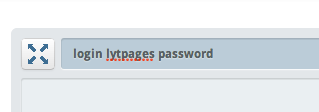
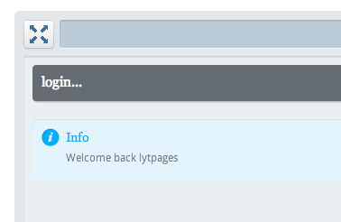

=========
The setup
=========

This tutorial will make the following assumptions:

    * Database is **lytpages**
    * Username is **lytpages**
    * User Password is **password**
    * Bytengine host is **127.0.0.1**
    * Bytengine port is **8500**

We are going to use the **Web Terminal** to write our Bytengine scripts. It should
be accessible at http://127.0.0.1:8500/terminal . To login with the above credentials
we'll type the following command: ``login lytpages lytpages``.

You should get the following reply:

Python helper functions
=======================

We are going to need a few python 'helper functions' to make our interactaction
with Bytengine simpler.

Here's a listing of actions we are going to carry out on Bytengine and their 
associated urls:

    * Login: ``http://127.0.0.1:8500/bfs/prq/login``
    * Request file upload ticket: ``http://127.0.0.1:8500/bfs/prq/upload``
    * Upload file: ``http://127.0.0.1:8500/bfs/upload/<request_ticket_id>``
    * Run script: ``http://127.0.0.1:8500/bfs/prq/run``

First we are going to create some global variables

.. code-block:: python

    # required modules

    import requests as Req
    import json
    import StringIO

    # global variables

    BE_HOST = "127.0.0.1"
    BE_PORT = 8500
    BE_USER = "lytpages"
    BE_PW = "password"

And now let's move on to our functions. We will start with the "**connect**"
function which logs us into Bytengine and returns a "**session id**" which we will
re-use in our subsequent Bytengine API calls.

.. code-block:: python

    def connect():
        postdata = {"username":BE_USER, "password":BE_PW}
        url = "http://{0}:{1}/bfs/prq/login".format(BE_HOST, BE_PORT)
        r = Req.post(url, data=postdata)
        reply = json.loads(r.text)    
        return reply["data"]

Bytengine API calls return JSON data in the following format:

.. code-block:: js

    // success JSON

    {
        "status":"ok",
        "data":< any_json_value >
    }

    // error JSON

    {
        "status":"error",
        "msg":"error message",
        "code":<integer value>
    }

Next is the "**uploadticket**" function. In order to upload a file attachment
to Bytengine you have to make an *upload request* which returns an
**upload ticket id** that can then be apended to the *upload file url*.

.. code-block:: python

    def uploadticket(bytengine_file_path):
        # login
        sessionid = connect()
        
        postdata = {
            "ticket":sessionid,
            "db":"lytpages",
            "path":bytengine_file_path
        }
        url = "http://{0}:{1}/bfs/prq/upload".format(BE_HOST, BE_PORT)
        r = Req.post(url, data=data)
        reply = json.loads(r.text)
        return reply["data"]

Let's move on to our **sendattachment** helper function which handles the actual
file upload from our drive to Bytengine.

.. code-block:: python

    def sendattachment(local_file_path, bytengine_file_path):
        ticket = uploadticket(bytengine_file_path)        
        url = "http://{0}:{1}/bfs/upload/{2}".format(BE_HOST, BE_PORT, ticket)
        file_object = open(local_file_path, 'rb')
        postdata = {'file':file_object}
        r = Req.post(url, files=postdata)
        reply = json.loads(r.text)
        file_object.close()
        return reply["data"]

The previous helper function is great for uploading files from our drive but should
we want to create text data on the fly and upload it as an attachment we would 
need the following function:

.. code-block:: python

    def sendattachment_string(text, bytengine_file_path):
        ticket = uploadticket(bytengine_file_path)    
        url = "http://{0}:{1}/bfs/upload/{2}".format(BE_HOST, BE_PORT, ticket)
        memory_stream = StringIO.StringIO()
        memory_stream.write(text)
        # set pointer to begining
        memory_stream.pos = 0
        postdata = {'file':memory_stream}
        r = Req.post(url, files=postdata)
        reply = json.loads(r.text)
        memory_stream.close()
        return reply["data"]

Finally we have our "**runscript**" function which lets us run from our application
code the Bytengine scripts that we can test beforehand in the Web Terminal:

.. code-block:: python

    def runscript(script_text):
        sessionid = connect()
        data = {"ticket":sessionid, "script":script_text}
        url = "http://{0}:{1}/bfs/prq/run".format(BE_HOST, BE_PORT)
        r = Req.post(url, data=data)
        reply = json.loads(r.text)    
        return reply

Now that the stage is set lets go on to our next topic :doc:`page_5`