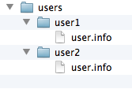
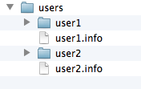
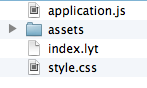
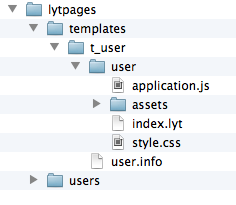

.. _tutorial-page_2:

==========================
Bytengine directory layout
==========================

Guidelines
==========

Lets talk about how we are going to organise our data in Bytengine. First its 
important to know that your directory and file layout is totally subjective but 
should be guided by the fact that Bytengine search queries don't recursively
*look into* sub-directories. Therefore if we had the following directory structure

and our user information was in the user.info files, running the following query
wouldn't return the required data:

.. code-block:: perl

    @lytpages.select "user.name" in /users ;

We would have to explicitly list the directories in which Bytengine should search
which would be:

.. code-block:: perl

    @lytpages.select "user.name" in /users/user1 /users/user2 ;

This could easily get unmaintainable for *n* number of users. A solution therefore
would be bring the ``*.info`` files into ``/users`` directory and rename them
accordingly as shown bellow:

Proposed Layout
===============

Right lets start building up our Bytengine directory structure already!

So we should probably start by creating our **lytpages** application directory to
contain our data

.. code-block:: perl

    @lytpages.newdir /lytpages ;

We will definitly need a **users** directory so lets add that

.. code-block:: perl

    @lytpages.newdir /lytpages/users ;

Now lets move onto our user account directory structure. As mentioned in the 
synopsis, we want our users to be able to upload page assets (pictures mostly)
so in order to maintain a 'clean' user account directory we should probably adopt
the following layout:

The ``index.lyt`` file will contain the user's main html code, ``application.js``
and ``style.css`` will be for the page javascript and css code respectively.
Finally ``./assets`` will contain their media uploads.

We are most likely going be re-creating this layout quite a few times (its going to be 
a popular app after all!) so we should probably have a separate user account 
creation script that we can re-call from our python code. But an even more elegant
solution would be to create the layout one in a ``/lytpages/templates`` directory
and make a '*copy*' of it anytime we need a new user account.

So lets go ahead and create our user account template:

.. code-block:: perl
    
    /* create main templates directory */
    @lytpages.newdir /lytpages/templates ;
    
    /* create our user account template directory */
    @lytpages.newdir /lytpages/templates/t_user ;

    /* fill it with required files & directories */
    @lytpages.newdir /lytpages/templates/t_user/user ;
    @lytpages.newdir /lytpages/templates/t_user/user/assets ;

    /* first our .info file */
    @lytpages.newfile /lytpages/templates/t_user/user.info {} ;

    /* followed by our other template files */
    @lytpages.newfile /lytpages/templates/t_user/user/index.lyt {} ;
    @lytpages.newfile /lytpages/templates/t_user/user/style.css {} ;
    @lytpages.newfile /lytpages/templates/t_user/user/application.js {} ;

    /* we need to make all page related files public so they can be served as static files from Bytengine */
    @lytpages.makepublic /lytpages/templates/t_user/user/index.lyt ;
    @lytpages.makepublic /lytpages/templates/t_user/user/style.css ;
    @lytpages.makepublic /lytpages/templates/t_user/user/application.js ;

.. note:: We have intentionally not added any metadata to our template files yet because
          that can be done at user account creation time.

So if we needed to create an account for a user *'jason'* our Bytengine script
would be:

.. code-block:: perl
    
    @lytpages.copy /lytpages/templates/t_user/user.info /lytpages/users/jason.info ;
    @lytpages.copy /lytpages/templates/t_user/user /lytpages/users/jason ;

And from python we could create a '*helper function*' to handle user account creation

.. code-block:: python

    def newuser_script(username):
        script = '''
        @lytpages.copy /lytpages/templates/t_user/user.info /lytpages/users/{uname}.info ;
        @lytpages.copy /lytpages/templates/t_user/user /lytpages/users/{uname} ;
        '''
        return script.format(uname=username)

Finally
=======

So here's what our application directory will finally look like:

And here are a few more python '*helper functions*':

Application directory initialisation function.

.. code-block:: python

    def dir_setup():
        script = '''
        @lytpages.newdir /lytpages ;
        @lytpages.newdir /lytpages/users ;
        
        /* create main templates directory */
        @lytpages.newdir /lytpages/templates ;

        /* create our user account template directory */
        @lytpages.newdir /lytpages/templates/t_user ;

        /* fill it with required files & directories */
        @lytpages.newdir /lytpages/templates/t_user/user ;
        @lytpages.newdir /lytpages/templates/t_user/user/assets ;

        /* first our .info file */
        @lytpages.newfile /lytpages/templates/t_user/user.info {} ;

        /* followed by our other template files */
        @lytpages.newfile /lytpages/templates/t_user/user/index.lyt {} ;
        @lytpages.newfile /lytpages/templates/t_user/user/style.css {} ;
        @lytpages.newfile /lytpages/templates/t_user/user/application.js {} ;

        /* we need to make all page related files public so they can be served as static files from Bytengine */
        @lytpages.makepublic /lytpages/templates/t_user/user/index.lyt ;
        @lytpages.makepublic /lytpages/templates/t_user/user/style.css ;
        @lytpages.makepublic /lytpages/templates/t_user/user/application.js ;
        '''
        return runscript(script)

New user account creation function.

.. code-block:: python

    def new_user(username, fullname, email):
        script = '''
        /* copy template */
        @lytpages.copy /lytpages/templates/t_user/user.info /lytpages/users/{uname}.info ;
        @lytpages.copy /lytpages/templates/t_user/user /lytpages/users/{uname} ;

        /* update user.info file with user details */
        @lytpages.modfile /lytpages/users/{uname}.info {content}
        '''
        # create json string from user details
        content = json.dumps({"fullname":fullname, "email":email})
        # execute script
        runscript(script.format(uname=username, content=content))

        # we  can create some default html text for the index.lyt file
        index_page_template = '''
        <html>
            <head>
                <title>welcome {uname}</title>
            </head>
            <body>
                <h1>Welcome to LytPages {uname}</h1>
            </body>
        </html>
        '''
        # upload as an attachment
        sendattachment_string(
            index_page_template.format(uname=username),
            "/lytpages/users/{uname}/index.lyt".format(uname=username)
        )

        return True

Let's now move onto :ref:`tutorial-page_3`
